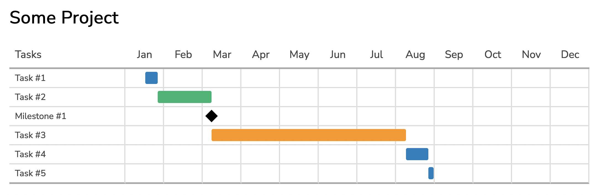

# Gantt Chart Generator

This is a simple Gantt chart generator written as [Dart](https://dart.dev/) command line tool.  Currently the tool generates an HTML/CSS Gantt chart.  It uses only `div` & `span` for HTML and everything else is done in CSS.  This allows you to cut/paste the output into a wiki pages that filter content, in particular [Confluence](https://www.atlassian.com/software/confluence).

## Installing

1. [Install Dart](https://dart.dev/get-dart).  I recommend installing it via [Flutter](https://docs.flutter.dev/get-started/install).
2. Create a sample JSON/JSON5 file (see below)
3. Build and run the tool with `dart pub global run gantt_generator -i scratch/project.json5 -o scratch/index.html`
4. Run a tool like [live-reload](https://www.npmjs.com/package/live-server) to view the `index.html` output in real time

## Interesting Details

The tool uses the following packages:

- [resource_portable](https://pub.dev/packages/resource_portable) to embed the HTML/CSS as a resource in the CLI tool
- [moustache_template](https://pub.dev/packages/mustache_template) for templating
- [json5](https://pub.dev/packages/json5) to load [JSON5](https://json5.org/) format files

It's a tool to solve a problem that I had.  I will probably add generation of JPEG/PNG images at some point.

Q: Why did I write it in Dart?
A: Because I've been developing Flutter apps for a while and I wanted to see what the state of the Dart ecosystem was for creating non-Flutter applications in Dart.

## Sample Project File

Here's a sample project file to show the format that the tool expects:

```json5
{
  startDate: "1/17/2022",
  title: "Some Project",
  items: [
    {
      title: "Task #1",
      duration: 8,
      color: 1,
    },
    {
      title: "Task #2",
      duration: 28,
      color: 2,
    },
    {
      title: "Milestone #1",
      color: 4,
    },
    {
      title: "Task #3",
      duration: 110,
      color: 3,
    },
    {
      title: "Task #4",
      duration: 14,
      color: 1,
    },
    {
      title: "Task #5",
      duration: 2,
      color: 1,
    },
  ],
}
```

And here's the output:


